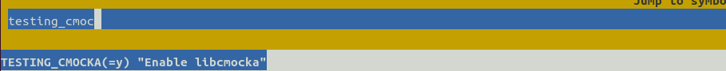
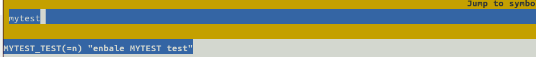
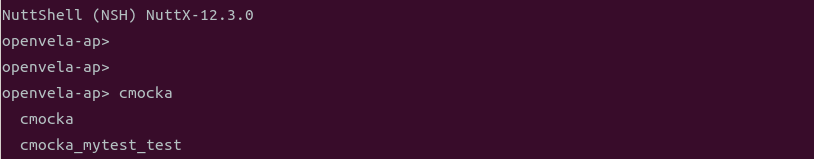
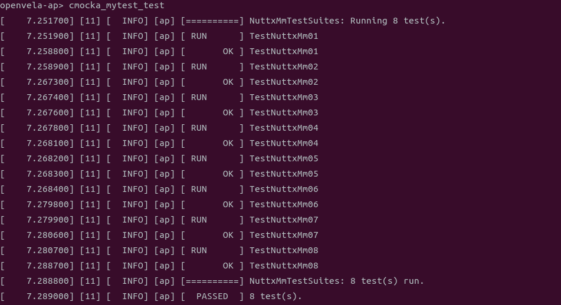
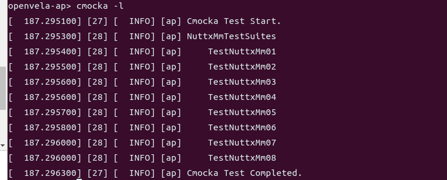
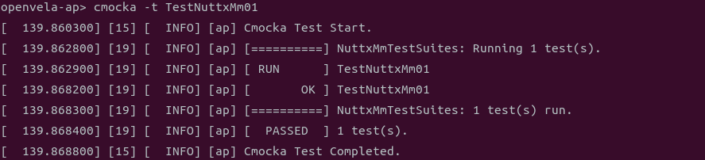
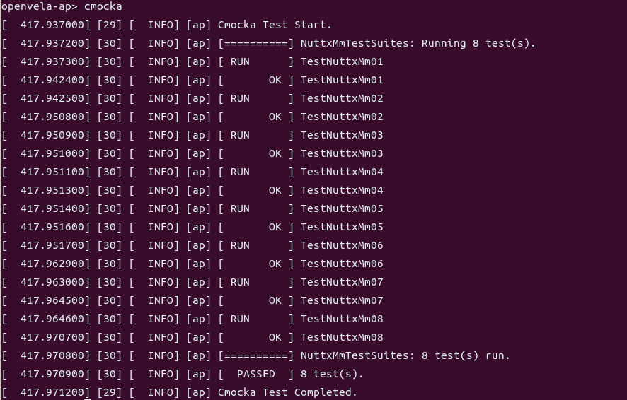

# Developing a Self-testing Execution Framework

\[ English | [简体中文](README_zh-cn.md) \]

## Introduction

openvela provides developers with a comprehensive self-testing framework, CMocka, allowing them to develop relevant test cases and detect defects early in the development phase, enhancing code quality. This article explains how to use the framework to develop test cases.

## Code directory structure

```Bash
├─tests
│    └──scripts
│       ├── env                                       #Environment requirements for automated framework
│       ├── script                                    #Test scripts executed by the automated framework
│       └── utils
│    ├── testcases                                    #Test tool collection
│    └── testsuites                                   #CMocka test tool collection
```

## Developing test cases

### 1. Creating a test case directory

Place all CMocka test cases under the `tests` directory. When you need to write new test cases with CMocka, follow these steps:

1. Create a subdirectory for the test cases and any necessary subdirectories to store test case files, header files, test resources, and test entry files, as shown below:

```Bash
├─tests
│   └── mytest  # Name of the automated test case collection, name based on your specific situation
│       ├── Kconfig
│       ├── Make.defs
│       ├── Makefile
│       ├── include    # Header files needed for test cases, this file contains declarations for custom functions
│       ├── src        # Directory for test case files
│       ├── util       # Directory for common function files
```

2. Modify the Kconfig file to set build options.

Define the test switch, priority, and STACKSIZE in the Kconfig file, as shown in the following example. Adjust according to your specific situation.

```Bash
config MY_TESTS                 
    tristate "vela auto tests mytest"
    default n
    **depends on TESTING_CMOCKA             #Must include, can depend on the module being tested**
    ---help---
        Enable auto tests for the open-vela

if MY_TESTS

config MY_TESTS_PRIORITY            #Priority
    int "Task priority"
    default 100

config MY_TESTS_STACKSIZE           #Stack size
    int "Stack size"
    default DEFAULT_TASK_STACKSIZE

endif
```

3. Modify the Makefile.

  Define the PROGNAME and MAINSRC files for the test. Refer to the following example and adjust based on your specific situation.

  Note: **PROGNAME must start with **`**cmocka_**`.

```Makefile
include $(APPDIR)/Make.defs
# Common functions and headers
CFLAGS += -I$(APPDIR)/tests/mytest/util
CSRCS += $(wildcard $(APPDIR)/tests/mytest/util/*.c)

# Test case files and test case headers
CFLAGS += -I$(APPDIR)/tests/mytest/include
CSRCS += $(wildcard $(APPDIR)/tests/mytest/src/*.c)

# Headers for any APIs needed (add based on your situation)
CFLAGS += ${INCDIR_PREFIX}$(APPDIR)/include

PRIORITY  = $(CONFIG_MY_TESTS_PRIORITY)
STACKSIZE = $(CONFIG_MY_TESTS_STACKSIZE)
MODULE    = $(CONFIG_MY_TESTS)

PROGNAME += cmocka_mytest_test       # PROGNAME for the test application name, used when starting in nsh
MAINSRC  += $(CURDIR)/mytest_entry.c  # Unified test entry file for all written test cases, CMocka unit test entry file (see section 2.2 for details on how to write this file)

include $(APPDIR)/Application.mk
```

4. Modify the Make.defs file.

```Makefile
ifneq ($(CONFIG_MY_TESTS),)
CONFIGURED_APPS += $(APPDIR)/tests/mytest
endif
```

### 2. Writing test cases

Create a new test case file under the `src` directory, suggesting that each file contains only one test case. Directory structure:

```Bash
├─tests
│   └── mytest     # Scenario automated test case collection
│       ├── Kconfig
│       ├── Make.defs
│       ├── Makefile
│       ├── include    # Header files needed for test cases, this file contains declarations for custom functions
│       │   ├── mytest.h
│       ├── src        # Directory for test case files
│       │   ├── test_mytest_example_01.c
│       │   ├── test_mytest_example_02.c
│       │   ├── test_mytest_example_03.c
│       ├── util
```

- Writing the test case file under the `src` directory:

  - Test case file naming: start with the keyword `**test_**`, include the **feature name**, e.g., `test_mytest_example_01.c`.
  - Test function naming: start with the keyword `**test_**`, e.g., `test_mytest_example_01(FAR void **state)`.

  A complete example is as follows:

```C
/****************************************************************************
 * Included Files
 ****************************************************************************/
// Five header files that must be included when using the CMocka framework
#include <stdarg.h>
#include <stddef.h>
#include <stdint.h>
#include <setjmp.h>
#include <cmocka.h>

// Other system headers
#include <xxx.h> 
// Test function definition header
#include "mytest.h"
#include "mytest_util.h"

/****************************************************************************
 * Name: test_mytest_example_01
 * Description: This is a simple example.
 ****************************************************************************/

void test_mytest_example_01(FAR void **state)
{
    int ret = 15;
    assert_true(ret > 0);
}
```

- Writing the header file under the `include` directory:
  - Header file naming: suggest including the **feature** and **test** keywords, e.g., `mytest.h`.
  - Define test functions, e.g., `void test_mytest_example_01(FAR void **state);`.
  - Define macros for the test case collection, adding all the cases that need to be tested.

A complete example is as follows:

```C
/****************************************************************************
 * Included Files
 ****************************************************************************/
// Five header files that must be included when using the CMocka framework, if included here, do not need to include them in the test case files mentioned above
#include <stdarg.h>
#include <stddef.h>
#include <stdint.h>
#include <setjmp.h>
#include <cmocka.h>

// Other system headers
#include <mytest.h> 

/****************************************************************************
 * Pre-processor Definitions
 ****************************************************************************/

// Define macro for the test case collection, add all the cases that need to be tested into it
// cmocka_unit_test_setup_teardown(f, setup, teardown) initializes a CMocka unit test structure, see the definition in the cmocka.h header file
// Here, the specific test function to be executed is test_mytest_example_01, and the corresponding setup and teardown functions for this function are: test_mytest_common_setup, test_mytest_common_teardown
#define CM_MYTEST_TESTCASES \
    cmocka_unit_test_setup_teardown(test_mytest_example_01, \
        NULL, NULL), \
    cmocka_unit_test_setup_teardown(test_mytest_example_02, \
        test_mytest_common_setup, test_mytest_common_teardown), \
    cmocka_unit_test_setup_teardown(test_mytest_example_03, \
        test_mytest_common_setup, test_mytest_common_teardown),
#endif

/****************************************************************************
 * Public Function Prototypes
 ****************************************************************************/

/* TEST CASES FUNCTIONS */
void test_mytest_example_01(FAR void **state);
void test_mytest_example_02(FAR void **state);
void test_mytest_example_03(FAR void **state);
```

### 3. Writing the test entry file

To better decouple the test cases and the test entry file of various modules, ensuring that modifications to individual modules do not render the entire test suite unavailable, the test entry file is isolated and placed under the root directory of the test cases for that module. The complete directory structure is shown below:

```Bash
├─tests
│   └── mytest
│       ├── Kconfig
│       ├── Make.defs
│       ├── Makefile
│       ├── include    # Header files needed for test cases, this file contains declarations for custom functions
│       │   ├── mytest.h
│       ├── src        # Directory for test case files
│       │   ├── test_mytest_example_01.c
│       │   ├── test_mytest_example_02.c
│       │   ├── test_mytest_example_03.c   
│       ├── util
│       ├── mytest_test.c         # Entry file for all written test cases when running
```

The test case entry file includes: headers and the main function for CMocka tests.

Note: The names of the test suites for each module must be different, as shown below with `MyTestSuite`.

```C
/****************************************************************************
 * Included Files
 ****************************************************************************/

// All headers needed for the tests
#include <setjmp.h>
#include <stdarg.h>
#include <stddef.h>
#include <cmocka.h>
#include "mytest_util.h"
#include "mytest.h"

/****************************************************************************
 * Name: cmocka_test_main
 ****************************************************************************/

int main(int argc, char* argv[])
{
      /* Add Test Cases, name cannot be the same as other test suites */
      const struct CMUnitTest MyTestSuite[] =
      {
            CM_MYTEST_TESTCASES
      };
      /* Run Test cases */
      cmocka_run_group_tests(MyTestSuite, NULL, NULL);
      return 0;
}
```

### 4. Defining setup and teardown functions

For a set of cases that have the same `setup` and `teardown`, i.e., initialization of the test environment and cleanup after the test (e.g., releasing memory, network reset, etc.). The `setup` and `teardown` can be abstracted out and placed under the common directory `util`. Directory structure:

```Bash
├─tests
│   └── mytest
│       ├── Kconfig
│       ├── Make.defs
│       ├── Makefile
│       ├── include    # Header files needed for test cases, this file contains declarations for custom functions
│       │   ├── mytest.h
│       ├── src        # Directory for test case files
│       │   ├── test_mytest_example_01.c
│       │   ├── test_mytest_example_02.c
│       │   ├── test_mytest_example_03.c    
│       ├── util
│           ├── media_util.c     # Common function implementation file
│           └── media_util.h     # Common function definition file
│       ├── mytest_test.c         # Entry file for all written test cases when running
```

`media_util.h` and `media_util.c` files are as follows:

```C
// media_util.h

int test_mytest_common_setup(FAR void **state);
int test_mytest_common_teardown(FAR void **state);
int get_mytest_time(void);
// media_util.c

static int mytest_time;

int test_mytest_common_setup(FAR void** state)
{
    mytest_time = 15;
    return 0;
}

int test_mytest_common_teardown(FAR void** state)
{
    mytest_time = 10;
    return 0;
}

int get_mytest_time(void)
{
  return mytest_time;
}
// test_mytest_example_02.c

void test_mytest_example_02(FAR void **state)
{
    int ret = get_mytest_time();
    assert_int_equal(ret, 15);
}
```

### 5. Using the state pointer

In the setup function, variables can be passed to the test case by the state pointer. The state pointer implementation is as follows:

```C
int test_mytest_pre_num_setup(FAR void **state);
int test_mytest_pre_num_teardown(FAR void **state);
int test_mytest_pre_num_setup(FAR void** state)
{
    struct mytest_state* priv;
    priv = malloc(sizeof(struct mytest_state));
    if (!priv)
        return -ENOMEM;

    priv->pre_num = 1;
    *state = priv;

    return 0;
}

int test_mytest_pre_num_teardown(FAR void** state)
{
    struct mytest_state* priv = *state;
    if (priv) {
        free(priv);
    }
  return 0;
}
void test_mytest_example_03(FAR void **state)
{
    /* Use variables defined in setup in test case */
    struct mytest_state *my_state = *state;  
    int ret = 10;
    assert_int_equal(ret, my_state->pre_num);
}
```

### 6. Assertions

CMocka provides a group of assertions for testing logical conditions, which are used similarly to the standard assert in C, implemented as follows:

```C
void test_mytest_example_01(FAR void **state)
{
    int ret = 15;
    assert_true(ret > 0);

    assert_non_null(ret);

    assert_in_range(ret, 10, 20);

    const uintmax_t ret_set[] = {10, 20, 30};
    assert_in_set(ret, ret_set, 3);
}
```

## Running test cases

### 1. Compiling test cases

1. Use menuconfig to enable the `TESTING_CMOCKA` switch.

   Note: `TESTING_CMOCKA` depends on `LIBC_REGEX`, and `LIBC_REGEX` depends on `ALLOW_MIT_COMPONENTS`. If these two configs are not enabled, you need to enable them first.

   ```Bash
   ./build.sh vendor/openvela/boards/vela/configs/goldfish-armeabi-v7a-ap menuconfig
   ```

   

2. Use menuconfig to enable the test case switch (CONFIG_MYTEST_TEST) defined in the module.

   

3. Proceed with compilation, executing the following command:

   ```Bash
   ./build.sh vendor/openvela/boards/vela/configs/goldfish-armeabi-v7a-ap -e -Werror -j20
   ```

### 2. Executing test cases

After compilation, enter nsh and execute the following command:

```Bash
./emulator.sh vela
```



- Input the corresponding PROGNAME to run tests. This method runs all test cases in the group in sequence. If you need the execution result of a specific case, you must wait for a certain period.

  

- openvela implements the CMocka command-line tool, used to flexibly execute test cases. Below are examples of listing all cases and executing specific cases.

  - List all cases, execute the following command:

    ```Bash
    cmocka -l
    ```

    

  - Execute the TestNuttxMm01 case, the `-t` parameter matches the case name.

    ```Bash
    cmocka -t TestNuttxMm01
    ```

    

### 3. Viewing test results

 There are three types of results for test case execution:

- **PASSED**
- **FAILED**
- **SKIPPED**

Note: If a test case FAILED, it displays the corresponding error information, including the code file, line number, and the reason for the exception, facilitating issue localization. After all cases are executed, statistics for the three types of results are provided.


