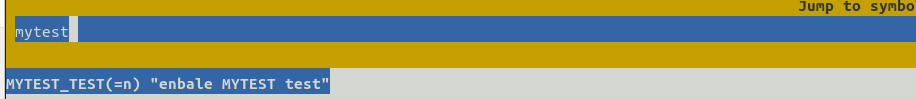
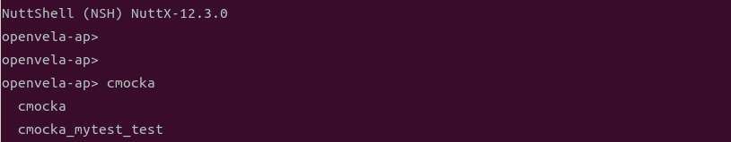

# 开发自测试执行框架

\[ [English](README.md) | 简体中文 \]

## 简介

openvela 为开发者提供了一套全面的开发自测试框架 cmocka，开发者可根据需求开发相关测试用例，在开发阶段提前发现缺陷，提高代码质量。本文介绍如何使用该框架开发测试用例。

## 代码目录

```Bash
├─tests
│    └──scripts
│       ├── env                                       #自动化框架环境要求
│       ├── script                                    #自动化框架执行的测试脚本
│       └── utils
│    ├── testcases                                    #测试工具集
│    └── testsuites                                   #cmocka 测试工具集
```

## 开发测试用例

### 1 新建用例目录

将所有 cmocka 编写的测试用例放在`tests`目录下。当需要使用 cmocka 编写新的测试用例时，操作步骤如下：

1. 在对应的子目录下创建测试用例的子文件夹及各级目录，用于存放测试用例文件、头文件、测试资源、测试入口文件等，目录结构如下图所示：

   ```Bash
   ├─tests
   │   └── mytest  # 自动化测试用例集名称, 根据自己的实际情况命名
   │       ├── Kconfig
   │       ├── Make.defs
   │       ├── Makefile
   │       ├── include    # 测试用例需要用到的头文件，该文件是自定义函数的声明文件
   │       ├── src        # 测试用例文件存放目录
   │       ├── util       # 公共函数存放目录
   ```

2. 修改 Kconfig 文件，设置编译选项。

    在Kconfig文件中定义测试开关、优先级、STACKSIZE，参考如下样例，根据实际情况完成 Kconfig 编写。

   ```Bash
   config MY_TESTS                 
       tristate "vela auto tests mytest"
       default n
       depends on TESTING_CMOCKA             # 必须包含，可以depends on所测试的模块
       ---help---
           Enable auto tests for the open-vela
   
   if MY_TESTS
   
   config MY_TESTS_PRIORITY            # 优先级
       int "Task priority"
       default 100
   
   config MY_TESTS_STACKSIZE           # stack size
       int "Stack size"
       default DEFAULT_TASK_STACKSIZE
   
   endif
   ```

3. 修改 Makefile 文件。

    定义测试的 PROGNAME 及 MAINSRC 文件。参考如下样例，根据实际情况完成 Makefile 编写。

    注意：**PROGNAME 必须以 cmocka_ 开头****。**

   ```Makefile
   include $(APPDIR)/Make.defs
   # 公共函数和头文件
   CFLAGS += -I$(APPDIR)/tests/mytest/util
   CSRCS += $(wildcard $(APPDIR)/tests/mytest/util/*.c)
   
   # 测试用例文件和测试用例头文件
   CFLAGS += -I$(APPDIR)/tests/mytest/include
   CSRCS += $(wildcard $(APPDIR)/tests/mytest/src/*.c)
   
   # 需要调用api的头文件（按实际情况添加）
   CFLAGS += ${INCDIR_PREFIX}$(APPDIR)/include
   
   PRIORITY  = $(CONFIG_MY_TESTS_PRIORITY)
   STACKSIZE = $(CONFIG_MY_TESTS_STACKSIZE)
   MODULE    = $(CONFIG_MY_TESTS)
   
   PROGNAME += cmocka_mytest_test       # PROGNAME为该测试的应用名称，在nsh启动时使用的名称
   MAINSRC  += $(CURDIR)/mytest_entry.c  # 所有编写的测试用例统一的测试入口文件，cmocka单元测试入口文件（该文件的具体写法参考下文第2.2章节）
   
   include $(APPDIR)/Application.mk
   ```

4. 修改 Make.defs 文件。

   ```Makefile
   ifneq ($(CONFIG_MY_TESTS),)
   CONFIGURED_APPS += $(APPDIR)/tests/mytest
   endif
   ```

### 2 编写测试用例

在 src 文件夹下新建测试用例文件，建议一个文件只包含一条测试用例。目录结构如下：

```Bash
├─tests
│   └── mytest     # 场景自动化测试用例集
│       ├── Kconfig
│       ├── Make.defs
│       ├── Makefile
│       ├── include    # 测试用例需要用到的头文件，该文件是自定义函数的声明文件
│       │   ├── mytest.h
│       ├── src        # 测试用例文件存放目录
│       │   ├── test_mytest_example_01.c
│       │   ├── test_mytest_example_02.c
│       │   ├── test_mytest_example_03.c
│       ├── util
```

- 编写 src 目录下测试用例文件。

  - 测试用例文件命名：以关键字 **“test_”**  开头，包含 feature name，例如`te``st_mytest_example_01.c`。
  - 测试函数命名：以关键字 **“test_”**  开头，例如`test_mytest_example_01(FAR void **state)`。

  完整样例如下：

  ```C
  /****************************************************************************
   * Included Files
   ****************************************************************************/
  // 使用cmocka框架时必须包含的5个头文件
  #include <stdarg.h>
  #include <stddef.h>
  #include <stdint.h>
  #include <setjmp.h>
  #include <cmocka.h>
  
  // 其他系统里用到的头文件
  #include <xxx.h> 
  // 测试函数定义头文件
  #include "mytest.h"
  #include "mytest_util.h"
  
  /****************************************************************************
   * Name: test_mytest_example_01
   * Description: 这是一个简单示例。
   ****************************************************************************/
  
  void test_mytest_example_01(FAR void **state)
  {
      int ret = 15;
      assert_true(ret > 0);
  }
  ```

- 编写 include 目录下头文件。

  - 头文件命名：建议包含 feature 和 test 关键字，例如`mytest.h`。
  - 测试函数定义，例如`void test_mytest_example_01(FAR void **state)`。
  - 定义测试用例集的宏，将所有需要测试的 case 添加进来。

完整样例如下：

```C
/****************************************************************************
 * Included Files
 ****************************************************************************/
// 使用cmocka框架时必须包含的5个头文件，如果在该头文件里包含了，则可以不用再在上述测试用例文件里包含
#include <stdarg.h>
#include <stddef.h>
#include <stdint.h>
#include <setjmp.h>
#include <cmocka.h>

// 其他系统里用到的头文件
#include <mytest.h> 

/****************************************************************************
 * Pre-processor Definitions
 ****************************************************************************/

// 定义测试用例集的宏，将所有需要测试的case添加进来
// cmocka_unit_test_setup_teardown(f, setup, teardown) 初始化cmocka单元测试结构体，详见cmocka.h 头文件里的定义
// 这里，具体要执行的方法为test_mytest_example_01, 该函数对应的setup和teardown函数分别为：test_mytest_common_setup， test_mytest_common_teardown
#define CM_MYTEST_TESTCASES \
    cmocka_unit_test_setup_teardown(test_mytest_example_01, \
        NULL, NULL), \
    cmocka_unit_test_setup_teardown(test_mytest_example_02, \
        test_mytest_common_setup, test_mytest_common_teardown), \
    cmocka_unit_test_setup_teardown(test_mytest_example_03, \
        test_mytest_common_setup, test_mytest_common_teardown),
#endif

/****************************************************************************
 * Public Function Prototypes
 ****************************************************************************/

/* TEST CASES FUNCTIONS */
void test_mytest_example_01(FAR void **state);
void test_mytest_example_02(FAR void **state);
void test_mytest_example_03(FAR void **state);
```

### 3 编写测试入口文件

为了更好的将各模块测试用例和测试用例入口解耦，保证各模块的修改不会引起整个测试集不可用，将测试入口文件独立出来，放在该模块测试用例根目录下，完整目录结构如下所示：

```Bash
├─tests
│   └── mytest
│       ├── Kconfig
│       ├── Make.defs
│       ├── Makefile
│       ├── include    # 测试用例需要用到的头文件，该文件是自定义函数的声明文件
│       │   ├── mytest.h
│       ├── src        # 测试用例文件存放目录
│       │   ├── test_mytest_example_01.c
│       │   ├── test_mytest_example_02.c
│       │   ├── test_mytest_example_03.c   
│       ├── util
│       ├── mytest_test.c         # 所有编写的测试用例运行时的入口文件
```

测试用例入口文件包含：头文件、cmocka测试的 main 函数。

注意：各个模块的用例集命名不能一样，如下文中的`MyTestSuite`。

```C
/****************************************************************************
 * Included Files
 ****************************************************************************/

// 所有测试用到的头文件
#include <setjmp.h>
#include <stdarg.h>
#include <stddef.h>
#include <cmocka.h>
#include "mytest_util.h"
#include "mytest.h"

/****************************************************************************
 * Name: cmocka_test_main
 ****************************************************************************/

int main(int argc, char* argv[])
{
      /* Add Test Cases，名称和其他的用例集不能有重复 */
      const struct CMUnitTest MyTestSuite[] =
      {
            CM_MYTEST_TESTCASES
      };
      /* Run Test cases */
      cmocka_run_group_tests(MyTestSuite, NULL, NULL);
      return 0;
}
```

### 4 定义 setup 和 teardown 函数

针对某一类 case，他们有相同的 `setup` 和`teardown`，即测试环境初始化和测试结束后销毁（例如释放内存，网络重置等）。可以将 `setup` 和 `teardown` 抽离出来，放到公共目录 `util` 下，目录结构如下：

```Bash
├─tests
│   └── mytest
│       ├── Kconfig
│       ├── Make.defs
│       ├── Makefile
│       ├── include    # 测试用例需要用到的头文件，该文件是自定义函数的声明文件
│       │   ├── mytest.h
│       ├── src        # 测试用例文件存放目录
│       │   ├── test_mytest_example_01.c
│       │   ├── test_mytest_example_02.c
│       │   ├── test_mytest_example_03.c    
│       ├── util
│           ├── media_util.c     # 公共函数实现文件
│           └── media_util.h     # 公共函数定义文件
│       ├── mytest_test.c         # 所有编写的测试用例运行时的入口文件
```

media_util.h 和 media_util.c 文件如下：

```C
// media_util.h

int test_mytest_common_setup(FAR void **state);
int test_mytest_common_teardown(FAR void **state);
int get_mytest_time(void);
// media_util.c

static int mytest_time;

int test_mytest_common_setup(FAR void** state)
{
    mytest_time = 15;
    return 0;
}

int test_mytest_common_teardown(FAR void** state)
{
    mytest_time = 10;
    return 0;
}

int get_mytest_time(void)
{
  return mytest_time;
}
// test_mytest_example_02.c

void test_mytest_example_02(FAR void **state)
{
    int ret = get_mytest_time();
    assert_int_equal(ret, 15);
}
```

### 5 使用 state 指针

在 setup 函数中创建的变量可由 state 指针传递给测试用例。state 指针实现如下：

```C
int test_mytest_pre_num_setup(FAR void **state);
int test_mytest_pre_num_teardown(FAR void **state);
int test_mytest_pre_num_setup(FAR void** state)
{
    struct mytest_state* priv;
    priv = malloc(sizeof(struct mytest_state));
    if (!priv)
        return -ENOMEM;

    priv->pre_num = 1;
    *state = priv;

    return 0;
}

int test_mytest_pre_num_teardown(FAR void** state)
{
    struct mytest_state* priv = *state;
    if (priv) {
        free(priv);
    }
  return 0;
}
void test_mytest_example_03(FAR void **state)
{
    /* 在测试用例中使用setup时定义的变量 */
    struct mytest_state *my_state = *state;  
    int ret = 10;
    assert_int_equal(ret, my_state->pre_num);
}
```

### 6 断言

cmocka 提供了一组用于测试逻辑条件的断言，其使用方法和标准 C 中的 assert 相同，实现如下：

```C
void test_mytest_example_01(FAR void **state)
{
    int ret = 15;
    assert_true(ret > 0);

    assert_non_null(ret);

    assert_in_range(ret, 10, 20);

    const uintmax_t ret_set[] = {10, 20, 30};
    assert_in_set(ret, ret_set, 3);
}
```

## 执行测试用例

### 1 编译测试用例

1. 使用 menuconfig 打开 `TESTING_CMOCKA` 开关。 

   注意：`TESTING_CMOCKA`依赖 `LIBC_REGEX`，而 `LIBC_REGEX` 依赖`ALLOW_MIT_COMPONENTS`，如果这两个config没有打开，需要先将其打开 。

   ```Bash
   ./build.sh vendor/openvela/boards/vela/configs/goldfish-armeabi-v7a-ap menuconfig
   ```

   

2. 使用 menuconfig 打开模块定义的测试用例开关（CONFIG_MYTEST_TEST）。

   

3. 进行编译，执行如下命令：

   ```Bash
   ./build.sh vendor/openvela/boards/vela/configs/goldfish-armeabi-v7a-ap -e -Werror -j20
   ```

### 2 执行测试用例

 编译完成后进入到 nsh，执行如下命令：

```Bash
./emulator.sh vela
```



-  输入对应 PROGNAME 进行测试，这种方式会按顺序将 group 中的测试用例全部跑一遍，如果需要某个测试用里的执行结果则必须等待一段时间。

  

- openvela 中实现了 cmocka 的命令行工具，用于灵活的执行测试用例，下面展示了使用其打印用例、执行指定用例的方式。

  - 打印所有用例，执行如下命令：

    ```Bash
    cmocka -l
    ```

    

  - 执行 TestNuttxMm01 用例，-t 参数会匹配相应的用例名称。

    ```Bash
    cmocka -t TestNuttxMm01
    ```

    

### 3 查看测试结果

 用例的执行结果有三种：

- **PASSED**
- **FAILED**
- **SKIPPED**

 说明：如果测试用例 **FAILED**，会显示相应的错误信息，包括代码文件、文件行号以及异常原因，方便去定位问题。所有用例执行完毕后，会对三种结果的用例进行统计。


